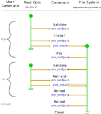

# Cylc Rose Dev Docs

Cylc Rose provides integration between Cylc and Rose.

Its functionality is defined in the
[cylc-rose proposal](https://github.com/cylc/cylc-admin/blob/master/docs/proposal-cylc-rose-installing-rose-configs.md).

## Cylc Rose Options

### Rose Config Files

Rose suite configurations are Cylc workflows which contain a `rose-suite.conf`
file at the top level. This file configures:

* Template variables.
* File installation.
* Environment variables for workflow configuration.

Rose suite configurations may additionally contain optional configuration files
in the `opts/` directory. Note that optional configurations may be turned on by
default via the `opt` configuration in the `rose-suite.conf` file.

### The Options

The Rose suite configuration may be extended or overridden via the Cylc Rose
CLI options.

Cylc Rose adds three options to Cylc Flow.

* `-S` - template variables
* `-D` - any arbitrary rose configuration (includes template variables)
* `-O` - optional configs

These options are currently hardcoded in the cylc-flow source code as we
do not yet have the ability for Cylc plugins (such as cylc-rose) to inject
options into cylc-flow commands.

There is also the `ROSE_SUITE_OPT_CONF_KEYS` environment variable which compliments
the `-O` option.

### Storage

Cylc Rose options passed in on the CLI are written to the
`~/cylc-run/<workflow-id>/opt/rose-suite-cylc-install.conf` file by
the `post_install` plugin.

This preserves these options so that they are inherited by subsequent commands
avoiding the need for users to remember which Cylc Rose options they have used
and specify them with all future commands.

### Reinstallation

On reinstallation, additional Cylc Rose CLI options may be provided.

If specified, these will override those previously specified on the CLI.

### Option Lifecycle

In order to support Cylc's compound commands (single commands that may perform
multiple individual operations as a transaction), the `post_install` plugin
deletes the Cylc Rose CLI options (from the object it was passed) after it has
written them to the filesystem.

This is necessary to avoid the same options being reenacted in later stages of
compound commands. See https://github.com/cylc/cylc-flow/issues/5968

